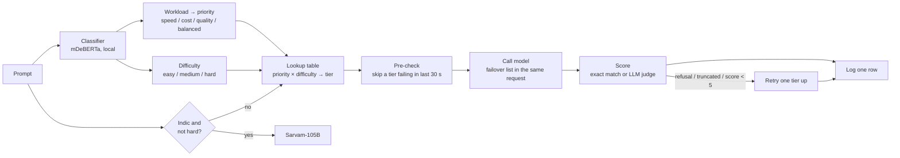

# Model Router

Sends each request to the cheapest model that is still good enough, and proves it with real API calls.
Built for the Sarvam GTM take-home. Every request is logged with the route, why it went there, tokens, cost, latency, quality score and whether a fallback fired.

- [Part 1: the router](README-PART1.md) – stack, routing policy, failure handling, baselines
- [Part 2: the economics](README-PART2.md) – monthly cost for 50M in / 10M out tokens
- [Part 3: business questions](README-PART3.md)

## How a request flows



No LLM is involved in routing. The classifier runs locally, costs no tokens, and its time is counted in every latency number.

## The models

| Tier | Model | ₹ per 1M tokens (in / out) | Used for |
|---|---|---|---|
| cheap | gemini-2.5-flash-lite | 8.8 / 35 | labels, yes/no, one-line answers |
| indic | sarvam-105b | 29.28 / 73.2 | Hindi, Tamil, Telugu, Hinglish that is not hard |
| mid | gemini-3.8-flash | 66 / 330 | summaries, extraction, translation; also the judge |
| upper_mid | claude-sonnet-5.5 | 176 / 880 | hard tasks when cost matters |
| frontier | claude-opus-5.5 | 352 / 1,760 | hard reasoning, legal, financial |

Prices checked 8 Oct 2026. 1 USD = ₹88. Thinking is off on every call.

## Run it

```bash
python3 -m venv .venv && source .venv/bin/activate
pip install -r src/requirements.txt
cp src/.env.example src/.env          # add OPENROUTER_API_KEY and SARVAM_API_KEY
cd src
python run_benchmark.py --limit 3     # dry run, 3 prompts x 3 configs
python run_benchmark.py               # full run, 30 prompts x 3 configs
uvicorn app:app --reload              # UI at http://127.0.0.1:8000
```

Outputs: `src/logs/requests.csv` (one row per request), `src/results/summary.csv`, `src/results/economics.md`.

## Files

| File | Does |
|---|---|
| `src/router.py` | the policy: two lookups, one table, one Indic rule |
| `src/classifier.py` | mDeBERTa zero-shot, workload and difficulty |
| `src/engine.py` | route → pre-check → call → score → fallback → log |
| `src/providers.py` | OpenRouter and Sarvam HTTP calls, retries |
| `src/health.py` | per-tier failure window |
| `src/quality.py` | exact match for labels, LLM judge for the rest |
| `src/config.py` | models, prices, tables, thresholds |
| `src/run_benchmark.py` | the three configs over 30 prompts |
| `src/app.py`, `src/static/index.html` | small UI to try a prompt and compare against both baselines |
| `src/data/prompts.json` | 30 held-out prompts, half Indic |
